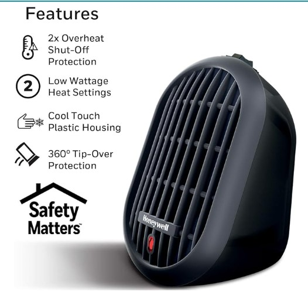
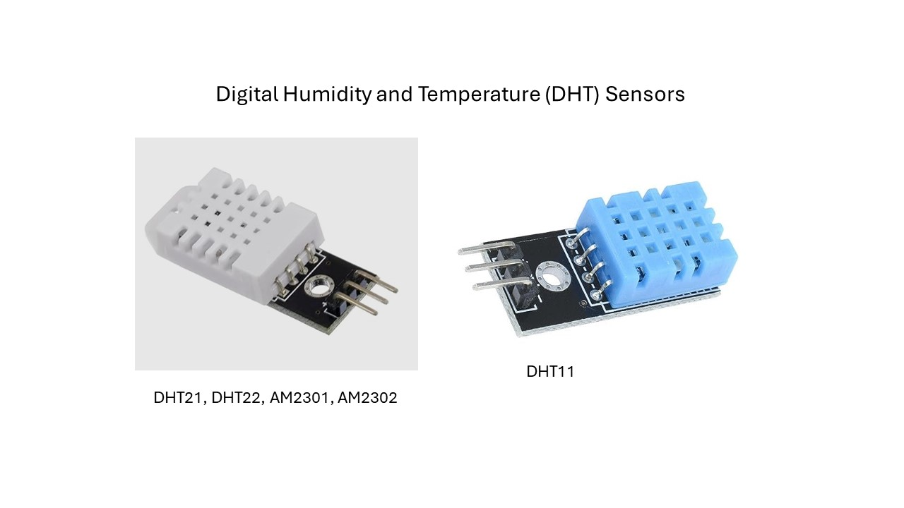
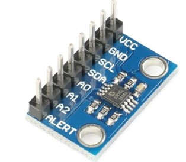
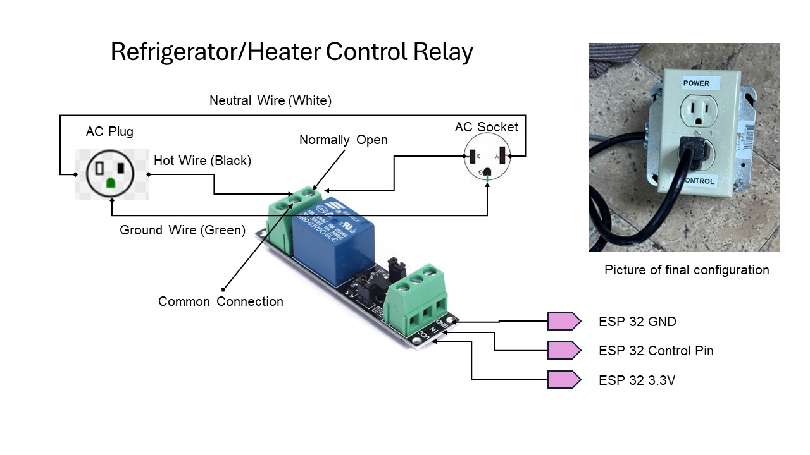

# Hardware Description

## Heater

I used a Honeywell HeatBud Ceramic Space Heater, Black – Energy Efficient Ceramic Heater with Two Heat Settings for Home, School or OfficeHeater.  This room heater offers multiple safety options including Overheat Protection, tip over protection and a cool touch handle. It also features easy-to-use one button controls and fast, even heating using only 250 watts.

Any little heater should work.  The following is the one I bought.

## Refrigerator

I bought a used refrigerator on Craigslist for $35.  The only real criteria is that your fermenter vessel fits in the fridge.

## Temperature Sensors

### DHT22/AM2302

The Digital Humidity and Temperature (DHT) Sensor Module is compact and easy to use module.

#### Features:

- Main Chip: AOSONG AM2302 High Sensitive Temperature Humidity Sensor
- Single-bus digital signal output, **bidirectional** serial data
- Temperature range: -40 to 80 degree celsius,
- Temperature measurement accuracy: +/- 0.5℃ degree celsius
- Humidity measuring range: 0~100%RH,
- Humidity measurement accuracy: ±2%RH

#### Specifications

Power supply 3.3-6V DC

Sensing element Polymer capacitor

Operating range humidity 0-100%RH; temperature -40~80 Celsius

Accuracy humidity +-2%RH(Max +-5%RH); temperature <+-0.5 Celsius

Resolution or sensitivity humidity 0.1%RH; temperature 0.1 Celsius

Repeatability humidity +-1%RH; temperature +-0.2Celsius

Humidity hysteresis +-0.3%RH

Long-term Stability +-0.5%RH/year

Sensing period Average: 2 seconds

## MCP9808 Precision Temperature Sensor

This MCP9808 digital temperature sensor is low cost temperature sensor with a typical accuracy of ±0.25°C over the sensor's -40°C to +125°C range and precision of +0.0625°C. It has a wide voltage range of 2.7 to 5.5 volts. You can typically buy them for about 6 dollars. The following is a picture of the typical device. The device works on the I2C bus that is explained in the next section.

## I2C Bus

The I2C bus is a standard **bidirectional interface** that uses a controller, known as the master, to communicate with slave devices. A slave may not transmit data unless it has been addressed by the master. Each device on the I2C bus has a specific device address to differentiate between other devices that are on the same I2C bus. The I2C bus can support 255 different addresses with a two wire interface.

All Arduino compaitible boards support the I2C bus. The MCP9808 has 3 address pins so you can connect up to 8 on the I2C bus. The base address 0x18.

The I2C bus is supported by the Arduino Wire library.

## Relay Electrical Outlet

The following are the specifications for the relay I selected.

30VDC 250VAC Load：The power switch is compatible with 10A 250VAC and 10A 30VDC load.

Optocoupler Isolator:3V/3.3V power relay module supports photocoupler isolation control.

The above schematic provides an overview of the connections. I included a
picture of my final product. I got the line cord off a food blender that was broken.
The line cord has 16-gauge wires.  The plug and the box were pieces I had laying around. The relay is enclosed inside the electrical box. The plug in the box goes to the freezer. I broke the power tab in the AC socket, so each socket is individual. I wired one socket to the relay normally open connection and the other to the relay normally closed connection. When the freezer is on the power socket is off and when the freezer is off the power socket is on.
