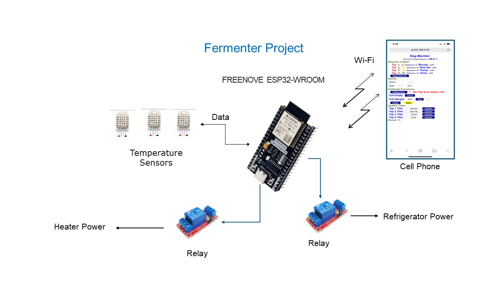
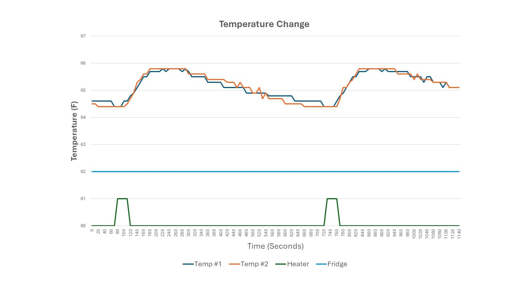

# Low Cost Beer Fermenter

The low cost beer fermenter uses an ESP32 microprocessor to read temperature sensor(s), control a refregerator, control a small heater and provide display and status.

Features:

- Low  cost (Less than 100 dollars)

- WiFi display from a phone or computer
  
  - Accessable anywhere in the world with Port Forwarding

- Sends eMail and Text message alerts

- Data Logging

- Temperature Stability +/- 0.75 degrees F

- Works with all DHT and/or MCP9808 Temperature Sensors
  
  - Upto 3 sensors can be used

## Materials list

| Item | Qty | Description             | Price  | Total  |
|:----:|:---:| ----------------------- | ------ | ------ |
| 1    | 1   | Refrigerator (Used)     | $35.00 | $35.00 |
| 2    | 1   | Heater (small personal) | $8.00  | $8.00  |
| 3    | 1   | ESP32 Development Board | $8.50  | $8.50  |
| 4    | 2   | Relay                   | $2.00  | $4.00  |
| 5    | 1   | DHT22 Temp Sensor       | $3.33  | $3.33  |
| 6    | 1   | ESP32 Breakout Board    | $13.00 | $13.00 |
| 7    | 2   | Electrical Outlet & Box | $6.00  | $12.00 |
|      |     |                         | Total  | $83.88 |

## Overview

 

## Theory of Operation

The theory of operation is very simple.  The desired temperature is input on the web page and the controller will turn on the refrigerator or heater to get to the desired temperature (goal).

The heater and refrigerator are deactivated by time instead of temperature due to hysteresis. If you try to work on the temperature change, the temperature will overshoot the goal.  For example, when the heater is turned on the heating element is turned on and heats up. When the heater is turned off the heating element is still hot  and releases energy until it reaches ambient temperature.

The following chart illustrates the issue. The temperature goal is 66 degrees F. The tolerance is 1.5 degrees. So, when the temperature drops to 64.5 degrees the heater turns on for 40 seconds. You can see on the chart that the temperature has barely changed when the heater turned off. The temperature rises almost to the goal while the heater is off. Because the outside temperature is less than the goal the refrigerator gradually cools off.  When the temperature drops to 64.5 degrees, the cycle repeats.

