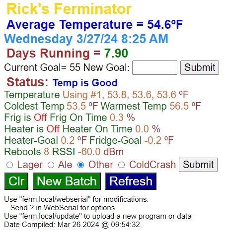

# Fermenter Program

The Fermenter Program controls the heater and refrigerator. The Arduino
configuration for this board is defined on the first line of the main
program. The Fermenter program uses an Asynchronous Web Server to host
the web page display. This program also gets the time of day from a
Network Time Protocol (NTP) server, sends emails, provides a Domain Name
System (DNS) server, (so you don’t have to type in IP addresses),
provides an Over the Air (OTA) program update capability and provides a
Web Serial Interface for debugging. The following figure is a sample of
what the main web page looks like.

The first line is the title of the web page. The second line is the
average temperature of the refrigerator. The third line is the day of
week, day/month/year date followed by the time of day (local time). The
next line is the number of days the fermenter has been running. The next
line is the temperature goal. This is the temperature you want the
program to keep the refrigerator at.

The status line provides status information and alarm information.

The temperature line provides the current temperature reading of the
temperature sensors. You can have up to three sensors. The “Using \#1”
shows the sensor that is currently being used to control the
refrigerator temperature. The refrigerator is controlled by the current
temperature not the average temperature.

The next line shows the warmest and coldest temperatures that have
occurred. If the outside temperature is changing below and above the
temperature goal, then the refrigerator temperature will move 1.5
degrees above and below the goal temperature. If the outside temperature
is always above or below the goal temperature, the temperature will
change 0.75 degrees. The default tolerance is 1.5 degrees, but you can
change this if you want it to be tighter.

The next two lines provide the refrigerator and heater status. They tell
you if they are currently on or off and the percentage of time, they
have been on during the fermentation process.

The next line shows how close the temperature was to the goal the last
time the heater or refrigerator were turned on. The last time the heater
was turned on the temperature was higher than the goal by 0.2 degrees.
The last time the refrigerator turned on the temperature was below the
goal by 0.2 degrees. Above the goal is positive and below the goal is
negative. You can use these values to adjust the heater and refrigerator
on time. Wait until these values are stable before using them. When the
heater of refrigerator turns off the values change until the maximum or
minimum value has been reached.

The next line is the Reboot count and the Received Signal Strength
Indicator (RSSI) in dBm. If there is a power failure or a program
glitch, the program will reboot and continue operating where it left
off. The RSSI level is the Wi-Fi signal strength. A level above -60 is
very good. The signal normally needs to be above -80 dBm to connect to
the Wi-Fi.

The radial selection indicators are used to select the mode. The modes
are described later.

The three buttons perform the following functions:

- Clr – Clears the Coldest, Warmest, and average temperature values.

- New Batch – Starts a new fermentation cycle. The Days Running, Reboot
  count, Heater On Time, and Frige On time are set to zero. The
  statistics are also reset.

- Refresh – Displays the latest information.

The next line displays the temperature sensor values in the freezer.
Depending on how many you have installed this line will either have none
or three values. The next line is the IP Address. This is a reserved
address that I have forwarded to the internet for access away from home.
If this address changes I know there is something wrong with my router.

The last lines just display reminder information.

## Starting a new Batch

It is very simple to start a new fermentation process. There are just
three steps:

1) Type in your goal temperature. Normal ale fermentation temperatures
   range from 68 to 72 °F and lager fermentation temperatures from 45
   to 55 °F. I set the temperature on the low end of the recommended
   temperature because during the fermentation process the beer is
   warmer than the refrigerator temperature.

2) Select Fermentation mode.
   
   1. Lager – After 6 days, the refrigerator temperature will start to
      increase. The temperature will increase up to 65 degrees on
      day 12. The temperature is increased to metabolize unwanted
      byproducts of fermentation like VDKs and acetaldehyde.
   
   2. Ale – After 3 days the temperature is increased 1 degree per day
      until a maximum temperature of 72 degrees is reached.
   
   3. Other – No temperature changes are made. You can manually adjust
      the temperature during the fermentation process.
   
   4. Cold Crash – When the cold crash mode is selected the
      temperature is decreased 5 degrees every half day until the
      minimum temperature of 35 degrees is reached. This will kill the
      yeast and make your final beer clearer. You can also add gelatin
      during the cold crash period to help clear the final product.

## Setup

When the processor is first powered up the setup process starts. One of
the first tasks is to connect to the Wi-Fi network. The built in LED
blinks rapidly while trying to connect. If the connection is successful,
the LED is on solid. If the connection is not successful, the RGB LED is
set per the following paragraph.

Since there is no local display, if there is a problem during setup it
is difficult to know what the problem is. To help in this situation, I
used the RGB LED that is on the FREENOVE WROOM board. The following list
shows the color of the RGB LED, and the problem encountered.

1. Color Red = No Temperature Sensors work

2. Color Yellow = One Temperature Sensors does not work

3. Color White = File System Corrupted or Config File Corrupted

4. Color Blue = Wi-Fi Could Not Connect

5. Color Cyan = MDNS Responder Error

6. Color Magenta = Failed to Set Time

7. Color Green all tests Passed.

## Passwords.h

**You must edit the “Passwords.h” file for the program to work.** This
file contains network names, network passwords, email addresses, email
passwords, DNS name and GMT offset. The file contains comments for all
the required entries.

## Files.ino

The files folder reads and writes the configuration information in a
file name config.txt. This file is in the “data” folder per the Arduino
standard. The configuration file must be uploaded to the ESP32 board for
the program to run. There are several places where you can find
instructions on setting up a file system and uploading files.
/<https://randomnerdtutorials.com/install-esp32-filesystem-uploader-arduino-ide/>.
I chose the LittleFS because it is small and reliable.

The ferminator.html file is also in the “data” folder. When you copy the
files, this file gets copied also.

## HTML.ino

The HTML module handles building the web page. During setup the
ferminator.html file is copied to a dynamic array named HTML Page.
During the copy process pointers are saved in an integer array named
indx. Every time the web page is accessed pointers are replaced by text
information and variable values. The build page function performs this
action. Every time the refresh button is pressed the latest information
is displayed.

## Sever.ino

This module handles the server requests. I used an asynchronous server
library because the WebSerial library only works with an asynchronous
server. Asynchronous servers use interrupts to process server requests.
So, if you use delay functions in your code the server requests will
still be processed. The server is fast, and I have not had any problems.
The /update and /webserial page requests are handled in the respective
libraries.

## Functions.ino

This module has general purpose functions including Initialize Wi-Fi and
time of day.

I used the Arduino standard \<TimeLib.h\> library for time of day
because it gives you more control over time-of-day handling. The time of
day is read from an NTP server during setup. The software accesses two
different NTP servers to get the time of day. When the time of day is
received the onboard Real Time Clock is set to maintain the time. The
software checks the time accuracy every day in the main loop.

The initialize Wi-Fi function connects to the local network. Since Wi-Fi
connection is the most important part of this program, the board will
try to connect to the Wi-Fi for 5 minutes. The Wi-Fi connection is
checked in the main loop every 5 minutes. If the connection has been
lost the board attempts to reconnect to the Wi-Fi.

## Email and Text Messages

To send an email with this application you need to use an app password
on Gmail. An app password is a 16-digit passcode that gives a less
secure app or device permission to access your Google Account. App
passwords can only be used with accounts that have 2-Step Verification
turned on.

I recommend generating a new Gmail account for emails from your Arduino
devices. You can set up a rule to forward these emails to your main
email account and/or to send them to generate a text message.

My phone service provider is T-Mobile, so to send a text message from an
email you type in the phone number and send it to tmomail.net
(<7145361998@tmomail.net>).

When you get an email, the subject is “Alert from Keg Monitor”. Emails
and text messages are sent for the following reasons.

"Keg Monitor: Temperature is too hot, above 40 degrees F.

"Keg Monitor: Temperature is too cold, below 30 degrees F.

"No communication with Keg Freezer for one hour"

## Port Forwarding

You should be able to do an internet search to help you do port
forwarding using your model router/modem. Basically, there are just two
steps: 1) Set a static or reserved IP address for your device based upon
the MAC address, 2) Forward the reserved IP address.

If you must replace your board, you can set the MAC address, so you
don’t have to redo your router settings. The normal port for a web page
is 80. But this did not work with my internet provider, so I used 8081
for the Keg Monitor.

To access your board, you use the internet service provider IP address
and 8081 port number. For example, <http://174.67.214.107:8081/>. To
find out your IP address, go to website https://www.myip.com/.
